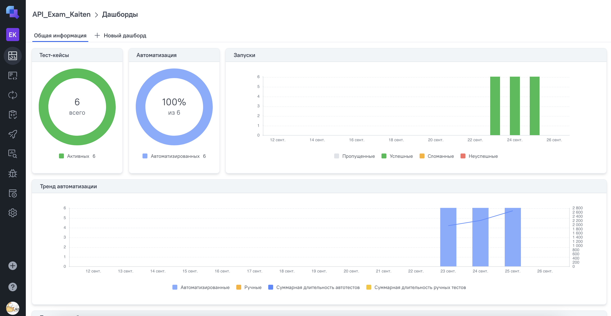
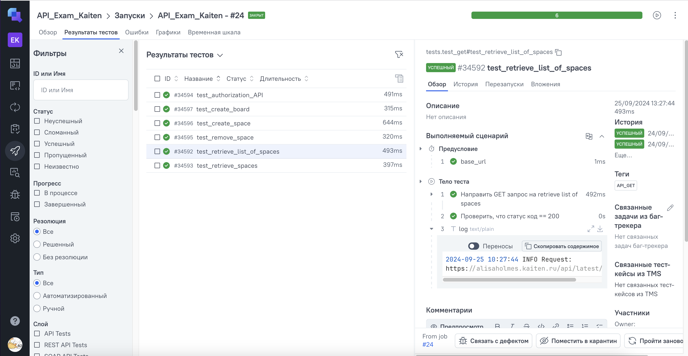
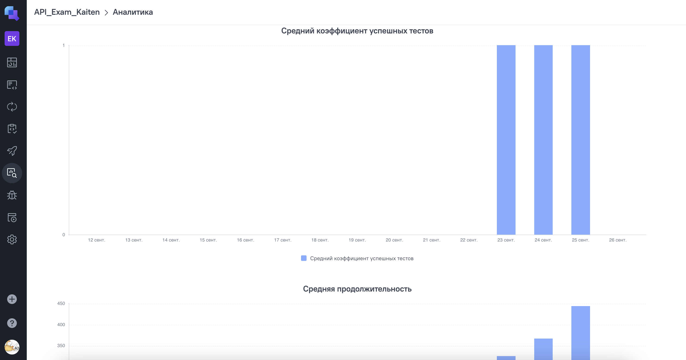

# Дипломный проект по тестированию API-запросов сайта таск-трекера "Kaiten"

### [Ссылка на сайт](https://kaiten.ru/)

## Содержание
- [Технологии и инструменты](#технологии-и-инструменты)
- [Список проверок API](#список-проверок-api)
- [Сборка проекта и запуск тестов в Jenkins с параметрами](#сборка-проекта-и-запуск-тестов-в-jenkins-с-параметрами)
- [Локальный запуск тестов и получение отчета](#локальный-запуск-тестов-и-получение-отчета)
- [Отчет в Allure-report](#отчет-в-allure-report)
- [Автоматическое оповещение о результатах сборки Jenkins в Telegram-бот](#автоматическое-оповещение-о-результатах-сборки-jenkins-в-telegram-бот)
- [Возможности Allure TestOps](#возможности-allure-testops)


## Технологии и инструменты
Проект реализован с использованием Python, PyCharm, Pytest, Allure Report, Jenkins, Allure TestOps, Telegram.
<p align="left">


     
      
     
     

## Список проверок API

- [x] Проверка успешной авторизации (GET-запрос)
- [x] Проверка успешного получения списка пространств (GET-запрос)
- [x] Проверка успешного получения одного пространства (GET-запрос)
- [x] Проверка успешного создания нового пространства (POST-запрос)
- [x] Проверка успешного создания новой доски (POST-запрос)
- [x] Проверка успешного удаления пространства (DELETE-запрос)
 
## Сборка проекта и запуск тестов в Jenkins с параметрами
> [Ссылка на сборку в Jenkins](https://jenkins.autotests.cloud/job/API_Exam_Kaiten/)  
### Для запуска автотестов в Jenkins  
> 1. Открыть [задачу в Jenkins](https://jenkins.autotests.cloud/job/API_Exam_Kaiten/)  
> 2. Нажать "**Build with Parameters**"  
> 3. Выбрать парметры 
> 4. Нажать "**Build**"

Результат запуска сборки и логи можно посмотреть в отчёте Allure в интерфейсе Jenkins 

## Локальный запуск тестов и получение отчета

<details><summary>1. Склонировать репозиторий</summary>

```
git clone git@github.com:alisaholmes/API_Exam_Kaiten.git
```
</details>

<details><summary>2. Создать и активировать виртуальное окружение, установить зависимости и запустить тесты</summary>

```
python -m venv .venv
source .venv/bin/activate
pip install -r requirements.txt
pytest . || true
```
</details>

<details><summary>3. Сформировать отчет о прохождении тестов в allure</summary>

```
allure serve allure-results
```
Или 
 
```
allure generate
```
</details>

 После выполнения команды в проекте появится папка Allure-report или автоматически откроется браузер с Allure-отчетом

## Отчет в Allure-report

<details><summary>Отчет о результатах тестирования в Allure-reports</summary>


</details>
<details><summary>Тесты</summary>


</details>

## Автоматическое оповещение о результатах сборки Jenkins в Telegram-бот


## Возможности Allure TestOps
Allure TestOps — это тест-менеджмент система для автоматизированных и ручных тестов. Она дополнительно позволяет хранить тест-кейсы, запускать тесты и смотреть результаты их выполнения. 
### Дашборд по результатам запуска

### Пример тест-кейса

### Аналитика запусков автотестов
